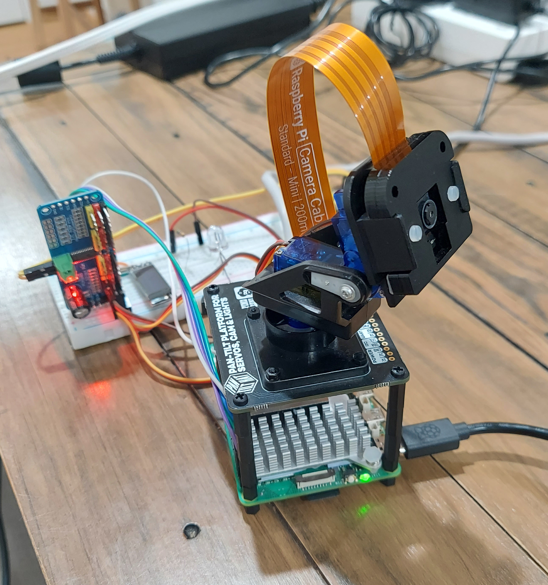

# Ocelot

Pan-tilt face tracking robot (Raspberry Pi 5), plus a simulated environment for training.

Uses a VLA trained on top of frozen DINOv2 and CLIP model embeddings, which can follow language commands like "look at the person in the hat" or "look at the person on the right."

## Hardware
| Component | Detail |
|---|---|
| Compute | Raspberry Pi 5 |
| Camera | Pi Camera V2 (CSI) |
| Servo driver | PCA9685 at I2C 0x40 |
| Servos | SG90 — pan ch0 (0–180°), tilt ch1 (90–180°) |
| OS | Pi OS Bookworm (Python 3.11) |



## Quickstart

### First time

```bash
docker compose build
docker compose up
```

### Launch Options

```bash
docker compose up                          # VLA model (INT8) — default
VISUALIZE=true docker compose up           # VLA + annotated stream
USE_HAAR=true docker compose up            # classical Haar cascade tracker
VLA_COMMAND="look at the person" docker compose up
USE_REMOTE_VLA=true REMOTE_VLA_URL=http://<workstation-ip>:8765/infer docker compose up
ROS_LOCALHOST_ONLY=1 docker compose up    # optional: keep ROS graph private to the Pi

# Change the active language command at runtime
ros2 param set /vla_node command "look at the person"
ros2 param set /remote_vla_client_node command "look at the person"

# Remote mode only: increase HTTP timeout if the first uncached command stalls
ros2 param set /remote_vla_client_node request_timeout_sec 1.0
```

### Development

```bash
make lint          # run Ruff
make hook-install  # enable the tracked pre-commit hook
```

The pre-commit hook auto-runs `ruff check --fix` and `ruff format` on staged
Python files, then re-stages the results before the commit completes.

`docker compose up` loads `models/active.onnx` — a symlink to the currently active INT8 model.
By default the Pi now exposes its ROS 2 graph on the LAN (`ROS_LOCALHOST_ONLY=0`), so a laptop
on the same network can inspect topics like `/camera/image_raw`. Set `ROS_LOCALHOST_ONLY=1` if
you want to isolate the ROS graph to the Pi again.

## Inference

### Offboard inference and cross-machine ROS over wired LAN

By default the Pi exposes its ROS 2 graph on the LAN (`ROS_LOCALHOST_ONLY=0`), so a laptop on
the same network can inspect topics like `/camera/image_raw`. Set `ROS_LOCALHOST_ONLY=1` if you
want to isolate the ROS graph to the Pi again.

To inspect the Pi's ROS graph from your laptop:

```bash
# On the Pi
docker compose up

# On your laptop
export ROS_DOMAIN_ID=0
export ROS_LOCALHOST_ONLY=0
ros2 topic list
ros2 topic echo /cmd_vel
```

To run the camera + servo stack on the Pi and the ONNX model on your workstation:

```bash
# On your workstation
export ROS_DOMAIN_ID=0
export ROS_LOCALHOST_ONLY=0
python -m ocelot.remote_vla_server \
  --checkpoint models/active.onnx \
  --token-cache models/active_tokens.json \
  --host 0.0.0.0 \
  --port 8765

# On the Pi
USE_REMOTE_VLA=true \
REMOTE_VLA_URL=http://<workstation-ip>:8765/infer \
docker compose up
```

The Pi keeps `camera_node` and `servo_node` local, JPEG-encodes each frame, posts it to the
workstation, and applies the returned `(pan_vel, tilt_vel)` commands locally. `servo_node`
zeros velocities if `/cmd_vel` goes stale for 250 ms, so a lost workstation or cable does not
leave the head slewing on the last command.

### Switching models

To deploy a new trained model to the Pi, run `make use-model` from the project root. It
quantizes `best.onnx` to INT8 (skipped if `best_int8.onnx` already exists), then updates
the `models/active.onnx` symlink:

```bash
make use-model RUN=runs/v0.1.1-single-face
docker compose up
```

Quantization runs inside the robot container (~30 s, once per checkpoint). Always deploy INT8 — FP32 models are too slow for real-time tracking on Pi 5 CPU.

To override the model at launch time without changing the symlink:

```bash
VLA_CHECKPOINT=/ws/src/ocelot/runs/v0.1.1-single-face/best_int8.onnx docker compose up
```

Editing Python source files does **not** require a rebuild (symlinks are live). Rebuilding
is only needed when `setup.py` entry points change.

### View streams

| Stream | URL |
|---|---|
| Raw | `http://<pi-ip>:8080/stream?topic=/camera/image_raw` |
| Annotated | `http://<pi-ip>:8080/stream?topic=/camera/image_annotated` |

### Sim (dev machine)

```bash
make sim-build   # build the sim image (once, or after Dockerfile changes)
make sim         # headless — no GUI, fast, works on any machine
make sim-gui     # Gazebo GUI — software rendering (no GPU required)
make sim-gpu     # Gazebo GUI — GPU accelerated (requires NVIDIA runtime)
make sim-xauth   # one-time X11 auth setup (re-run if display session changes)
```

The colcon build is fast on repeat runs — named volumes (`sim_build`, `sim_install`) cache artifacts between container invocations.

After ~15 seconds the sim is fully up: the face billboard starts oscillating in both pan (Y) and tilt (Z), and the tracker follows it automatically. No manual steps needed.

Verify tracking is working from a second shell in the container:
```bash
ros2 topic echo /joint_states --field position   # pan/tilt positions should change
```

More sim workflows, including the episode runner and scenario-generator smoke tests, are in
[docs/SIM.md](docs/SIM.md). Data collection, training, checkpoint evaluation, and VLA sim/live
validation are in [docs/TRAINING.md](docs/TRAINING.md).

---

Validation and bring-up checks are in [docs/TROUBLESHOOTING.md](docs/TROUBLESHOOTING.md).


## Project Structure

```
ocelot/
├── ocelot/
│   ├── camera_node.py       # ROS node (py3.12), spawns capture_worker
│   ├── capture_worker.py    # picamera2 capture (py3.11 subprocess)
│   ├── cmd_vel_adapter.py   # sim/teleop velocity adapter
│   ├── servo_node.py        # PCA9685 servo control
│   ├── tracker_node.py      # Haar cascade proportional controller
│   ├── oracle_node.py       # Privileged ground-truth FK tracker (sim only)
│   ├── oracle_validator.py  # Pixel-error measurement for oracle validation
│   ├── remote_vla_client_node.py  # Pi-side HTTP client for offboard inference
│   ├── remote_vla_server.py       # workstation HTTP server for ONNX inference
│   ├── vla_inference.py     # shared ONNX/token inference helpers
│   ├── vla_node.py          # local ONNX inference node
│   └── visualizer_node.py   # Annotated image publisher (optional)
├── launch/
│   ├── sim_launch.py
│   └── tracker_launch.py
├── config/tracker_params.yaml
├── config/controllers.yaml
├── urdf/pan_tilt.urdf
├── bags/                    # rosbag recordings (gitignored)
├── scripts/                 # bare-metal validation (no ROS needed)
│   ├── test_camera.py
│   ├── test_servos.py
│   └── test_tracking_manual.py
├── deploy/docker/
│   ├── Dockerfile.robot     # robot deployment image (Pi 5)
│   ├── Dockerfile.sim       # sim/training image
│   ├── docker-compose.yml   # robot compose config
│   ├── docker-compose.sim.yml
│   └── docker-compose.sim.gpu.yml
├── docker-compose.yml       # convenience wrapper — includes deploy/docker/
├── package.xml              # ament_python
├── setup.py
└── setup.cfg
```

## Docs

Additional details moved out of the main README:

- [Training guide](docs/TRAINING.md)
- [Sim guide](docs/SIM.md)
- [Rosbag guide](docs/ROSBAG.md)
- [Architecture overview](docs/ARCHITECTURE.md)
- [Troubleshooting](docs/TROUBLESHOOTING.md)

---

## Further Reading

A couple articles about debugging issues in the project:

- https://nathanclonts.com/we-only-learn-from-error/
- https://nathanclonts.com/robot-logs-0/
